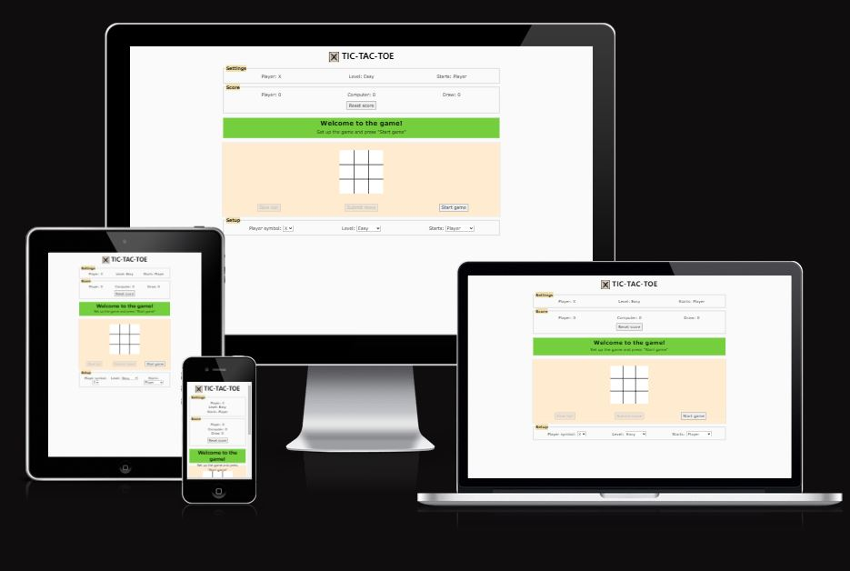
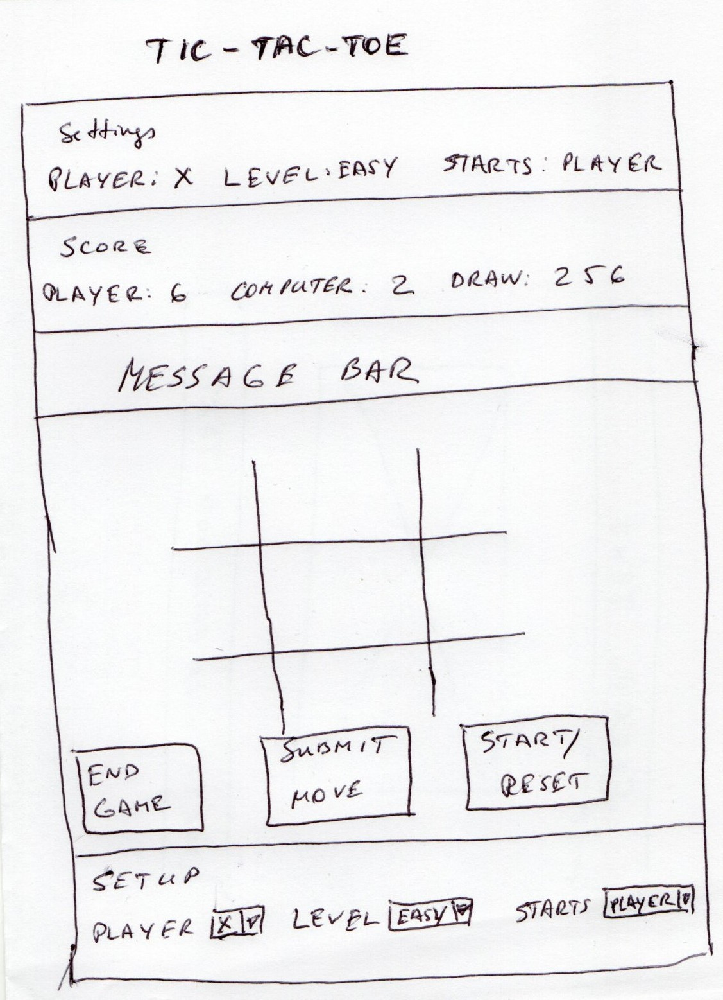
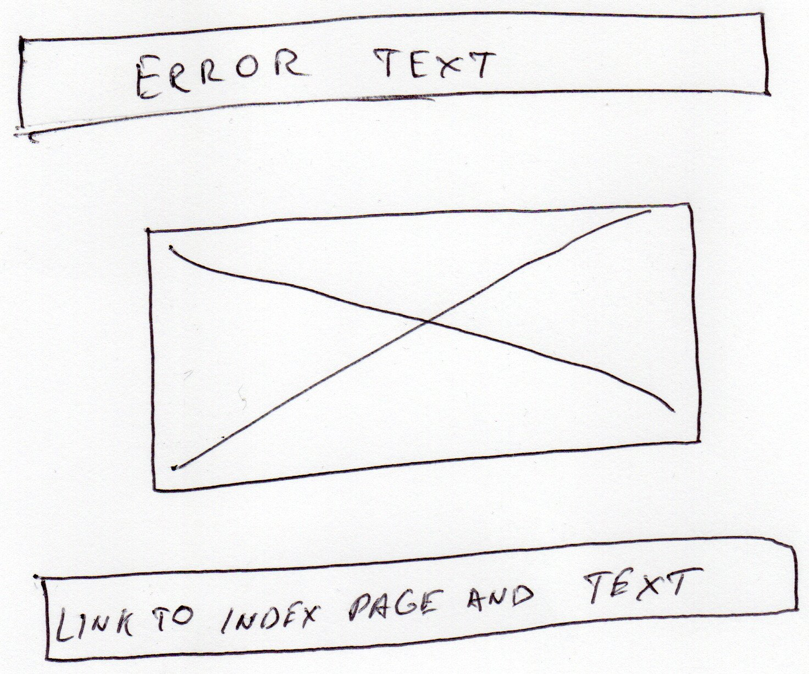
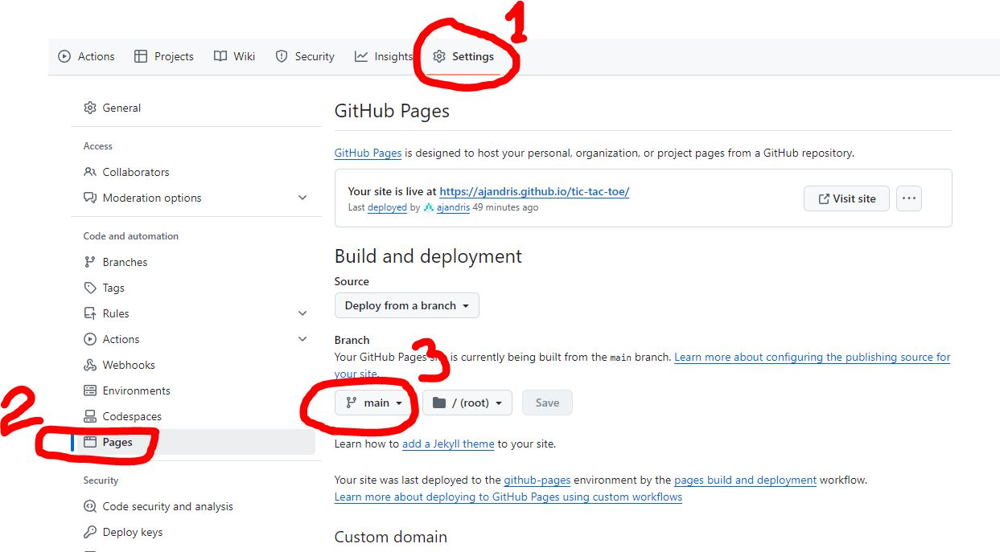

# TIC-TAC-TOE game

## Gameplay

<a href="https://ajandris.github.io/tic-tac-toe/">Play the game on GitHub</a>

1. The Board:

   * You have a 3x3 grid (a total of 9 squares).
   * Each square represents a spot where you can place your mark.

2. Players:

   * Tic-Tac-Toe is typically played by two players (a player and a computer on this site).
   * One player uses “X,” and the other uses “O.”

3. Objective:

   * The goal is to get three of your marks in a row: either horizontally, vertically, or diagonally.

4. Turns:
   * Players take turns placing their marks on the empty squares.
   * The starting player (usually “X”) alternates with each new game.

5. Winning:

   * If a player manages to get three of their marks in a row, they win!
   * The winning line can be:
     * Horizontal (across a row)
     * Vertical (down a column)
     * Diagonal (from one corner to the opposite corner)

6. Ties (draw):

   * If all nine squares are filled, and neither player has achieved three in a row, the game ends in a tie (draw).

7. Zero-Sum Game:

   * Tic-Tac-Toe is a zero-sum game. This means that if both players play optimally, the game will always end in a tie.
   * However, with some simple strategies, you can increase your chances of winning.

8. User can set up preferences:
   * symbol to play with ("X" or "O"),
   * difficulty level (easy, medium or pro),
   * who starts the game: player or computer.

9. Settings user is playing with are shown on the block Settings.

10. Block "Score" shows the summary result in series of played games. Button "Reset" sets all results to zero.

## Used Technologies
The site is designed using:

* HTML
* CSS
* W3.CSS stylesheet framework
* JavaScript

Some other utilities were used:

* JetBrains WebStorm as Integrated Development Environment.
* GitHub to store code and version control.
* GitHub Pages for publishing the game.
* Grammarly to catch grammar slips and improve the text.

# Development
This part is dedicated to the page's development.

## To Do
> Expand and change ToDo as development progresses.

### Fill the details in README.md
- [X] Strategy plane
- [X] Scope plane
- [X] Structure plane
- [X] Skeleton Plane
- [X] Surface Plane

### Functionality description

### Page designs
- [X] Game page
- [X] 404 error page

### Testing
- [ ] Testing description
- [ ] Validator test screenshots for each page

### Deployment
- [ ] the game page
- [ ] 404 page

### Other
- [ ] Acknowledgements
- [X] Site's Description
- [ ] Update wireframes
- [X] Update gameplay in introduction

## The Development process
The Development of this site includes consequently following the stages described in detail in the next sections:

* Requirements gathering described in Strategy Plane – gathering all requirements to the Site. User Stories belong to this stage.
* Scope definition described in Scope Plane – defining what will be included in the first release.
* At the start of the design comes the Structure plane, where wireframes are used to design sketches of the pages.
* The result of a Skeleton plane is the Site’s navigation.
* The last in Development comes the Surface plane, where all design is completed for various screen sizes and audiences. This plane includes all JavaScript functionality.
* Then comes the Site testing, which is performed manually, using Jigsaw (CSS) and W3 Validator (HTML). Google’s Lighthouse test is used to test the site’s performance.

### Strategy plane

#### User stories

* As a player:
   * [USP-1] I want to play Tic-Tac-Toe game
   * [USP-2] I want to have in the game three difficulty levels: Easy, Moderate and Advanced
   * [USP-3] I want to add Settings section where user can choose what symbol to play, whether to start game and what difficulty level to play
   * [USP-4] I want to count score of the game series
* As a site owner:
  * [USO-1] I want to implement Tic-Tac-Toe game using JavaScript, HTML and CSS only
  * [USO-2] I want to improve game's accessibility by adding 404 Error (file not found) page with a link to the game page

#### Intended audience
The Tic-Tac-Toe game has entertainment purpose and can be used for everyone willing to play the game.

As a site owner I would like to show everyone my skills in HTML, CSS and JavaScript, so everyone can evaluate them.

### Scope plane
At the end of development will be delivered:
* Implemented User Stories
* User Manual as a section in README.md file
* Development documentation in README.md file, in particular:
  * Requirements,
  * Functional specifications,
  * Testing process,
  * Deployment to GitHub pages.
* Version control using Git and GitHub

### Structure plane

The structure plane is concerned with design elements – what will be on pages. 
Wireframes allow seeing what will be on pages. There is no detailed design or colours (in most cases); 
schematic elements only are placed on a page.

The game's behaviour requirements are described in a separate section below.

#### Game page wireframe

#### 404 Error page wireframe

## Skeleton Plane

Skeleton Plane is concerned about the functionality of the site.

### The game page

The game page has five blocks: Settings, Score, Messages, Game Board and Setup.

#### Block: Settings

The Block Settings is on top of the game area and contains the game's conditions.

Settings reflect values set in the Setup block, e.g.,

Settings.Player.value = Setup.Player.value (player’s symbol: X or O)

Settings.Level.value = Setup.Level.value (levels: Easy, Medium and Pro)

Settings.Starts.value = Setup.Starts.value (Who makes the first move: Player or Computer)

#### Block: Score

The block Score shows the result since the page is loaded or last Reset.

The Score increments by one after each game for Player, Computer or Draw, depending on the result.

The “Reset” button sets all scores to “0” (zero) and is inactive during the game.

#### Block: Messages

Shows messages before, during and after the game.

| **No** | **Case** | **Message** |
| --- | --- | --- |
| MSG1 | Player wins | Congratulations! You won. |
| MSG2 | Computer wins | I won. Good luck next time. |
| MSG3 | Draw | Draw. |
| MSG4 | The player tries to put his symbol on the occupied cell. | Wrong move. Click on the unoccupied box. |
| MSG5 | Game finished. That will be a second line when the results are shown. | Press “Clear” to clear the board to start another game. |

#### Block: Setup

A player sets his game preferences.

| **Name** | **Input Type** | **Values** | **Comment** |
| --- | --- | --- | --- |
| Player | Combo Box | “X”, “O” | The symbol the player prefers to play with. |
| Level | Combo Box | “Easy”, “Medium” and “Pro” | Difficulty level |
| Starts | Combo Box | “Player”, “Computer” | Who makes the first move? |

Block Setup Input fields are disabled during the game.

#### Block: Game Area

The game area has three buttons:

Give Up! – to stop the current game

Submit move – to submit move

Start/ Clear – start the game or clear the deck (has one of the labels Start or Clear depending on the game stage)

Table 1 Button states depending on the game stage

| **State/ button** | Give Up! | Submit move | Start/ Clear |
| --- | --- | --- | --- |
| Before the start of the game | Disabled | Disabled | Label: Start, enabled |
| During game | Enabled | Enabled, temporarily disabled until computer move shows up. | Label: Start, disabled |
| After Game | Disabled | Disabled | Label “Start” if the game desk is clear, label “Clear” otherwise |

**Before the start of the game**

The game board is empty, the buttons “Give Up!” and “Submit Move” are disabled, and the button “Start/Reset” has the label “Start” and is active.

**The Game**

The game starts when a player clicks on the button “Start”.

_The program:_

1. disables the button “Start” and enables buttons “Give Up!” and “Start”
2. Read all settings and disable them
3. If _settings.starts.value_ = player, then wait for a player to move; otherwise, calculate and show the computer’s move

**_The player’s move_**

Every cell of the has-like game board contains none or one of the symbols “X” or “O”.

Players’ symbols are taken from _settings.player.value_.

A player can add his symbol by clicking on a cell with a white background. When a player submits his move, the last selected cell becomes grey and is inaccessible for players to put their symbols.

Pressing on the symbol again removes the symbol from the cell. When the player clicks on another empty cell, the previously selected symbol disappears from that cell, and a is shown in the new cell.

When a player clicks on an occupied cell, MSG4 is displayed in the message block in red and bold with a white background.

The “Submit move” button is inactive while no new symbol is on the board.

When the move is decided, a player clicks on the “Submit move” button.

If there are three player’s symbols in one row, column or diagonal, the player has won:

1. Messages MSG1 and MSG5 (on a second line) are displayed in the message block on a green background. MSG1 is bold.
2. Players’ symbols are displayed green and flashed for 5 seconds.
3. Players’ score is incremented by one.

If after the player’s move, there are no more empty cells on the board (draw):

1. Messages MSG3 and MSG5 (on a second line) are displayed in the message block on a white background. MSG2 is bold.
2. The draw score is incremented by one.

**Computer’s move**

The computer’s move depends on the difficulty level (settings.level.value).

_Level: Easy_

All computer moves are random and calculated for empty board cells only.

_Level: Medium_

The first move is random; the rest are calculated like in the Pro level.

_Level: Pro_

All moves are calculated.

**_Move calculations_**

There are consecutive checks to perform. When a move condition is met, no further checks are required. What to do in each case is described below.

1. If a line (row, column or diagonal) has two computer symbols, the computer move is to place its symbol on that line (computer wins).
2. If a line (row, column or diagonal) has two player’s symbols, the computer move is to place its symbol on that line (eliminate threat).
3. Place the computer’s symbol in the centre if empty.
4. Place the computer’s symbol in the corner of two empty lines.
5. Place the computer’s symbol in the corner of one empty line and a single computer’s symbol on another line.
6. Place the computer’s symbol on the line with a computer’s symbol.
7. Place the computer’s symbol on the last available cell (draw).

When a move is chosen, check the victory conditions:

1. Three computer symbols are on one line (row, column or diagonal):
    1. Messages MSG2 and MSG5 (on a second line) are displayed on a light red background in the message block. MSG2 is bold.
    2. The computer’s symbols are displayed in red and flashed for 5 seconds.
    3. The computer’s score is incremented by one.
2. no more empty cells (draw):
    1. Messages MSG3 and MSG5 (on a second line) are displayed in the message block on a white background. MSG2 is bold.
    2. The draw score is incremented by one.

**After game**

1. The button “Start/Clear” label changes from “Start” to “Clear”.
2. Buttons “Give Up!” and “Submit move” become inactive.
3. When the button “Clear” is clicked:
    1. All cells on the game board are set to empty with a white background,
    2. The label on the button is changed from “Clear” to “Start”.

### The error page

Error pages are pages that are shown by a web server when something goes wrong.

This project contains a customised “Error 404—Page not found” page, which is shown when the web server cannot find the requested page.

It has two navigational features:

1. Automatic refresh and redirect to the game page in 10 seconds
2. A link to the game page is shown to the user

### Surface Plane
All pages are designed to adapt seamlessly to various screen sizes. Whether it's a desktop, tablet, or mobile screen, the user experience remains consistent and optimal.

Due to the small project size, there is no design mock-up, and all elements will be built during development using the try-and-fix method.

***Colour pattern***

* Page background:
* Font colour: 
* Game board - empty cell: #FFFFFF
* Game board - occupied cell: grey
 

***Other***
Game board borders: 1px, black 

The main content box background colour with opacity: rgba(30, 42, 48, 0.75)

### Testing

Software testing, a crucial step in software development, is the process of evaluating and verifying whether a software application meets its expected requirements and functions correctly, ensuring the end product is of high quality and meets user expectations.

It aims to identify defects, bugs, or missing features in contrast to the specified requirements.

Essentially, it answers two critical questions:

- Is the software built the right way? (does the software correctly implement specific functions?)
- Is it the right product?” (does the software align with customer requirements or user stories?)

This project uses manual testing and acceptance testing.

During **manual testing**, the test operator manually checks if the system works as expected by going through all screens and simulating end-user behaviour. The user interface is also checked for look and feel during this test. In web development, web pages are tested against different screen sizes, browsers, and operation systems.

The functionality of the system can be automated using test scripts. For that purpose, **automated tests** are used. Automated tests are helpful for large projects to ensure the new functionality does not change old behaviour. They increase testing speed but add extra work for writing them. One of the testing frameworks for JavaScript is Jest. Automated tests are not used for this project as the project has no continuity, and writing tests adds extra work.

**Acceptance tests** ensure that all user requirements are met. In this project, they are user stories.

#### Acceptance test

| **Test id** | **User story id** | **User story description** | **Pass/Fail** | **Additional info**                                                                                                                                                                                       |
| --- | --- | --- | --- |-----------------------------------------------------------------------------------------------------------------------------------------------------------------------------------------------------------|
| TUSP-1 | USP-1 | I want to play the Tic-Tac-Toe game. | Pass | <a href="assets/readme/amiresponsive.jpg">Link</a>                                                                                                                                                        |
| TUSP-2 | USP-2 | I want three difficulty levels in the game: Easy, Moderate, and Advanced. | Pass | <a href="assets/readme/testing/pass/difficulty_level.jpg">Link</a>                                                                                                                                        |
| TUSP-3 | USP-3 | I want to add a Settings section where the user can choose what symbol to play, whether to start the game and what difficulty level to play. | Pass | There is a <a href="assets/readme/testing/pass/setup.jpg">Setup</a> section where user can do so. <a href="assets/readme/testing/pass/settings.jpg">Settings</a> section shows what are current settings. |
| TUSP-4 | USP-4 | I want to count the score of the game series. | Pass | <a href="assets/readme/testing/pass/score.jpg">Score section</a> shows results of the game series.                                                                                                        |
| TUSO-1 | USO-1 | I want to implement the Tic-Tac-Toe game using JavaScript, HTML and CSS only. | Pass | The <a href="assets/readme/testing/pass/project_structure.jpg">project structure</a> shows only html, css, js and image files.                                                                            |
| TUSO-2 | USO-2 | I want to improve the game's accessibility by adding a 404 Error (file not found) page with a link to the game page. | Pass | <a href="404.html">404.html</a> file is added.                                                                                                                                                            |

#### Page validations

**_HTML validator (_**[**_https://validator.w3.org/_**](https://validator.w3.org/)**_)_**

**Main page**

There were some errors; see the <a href="assets/readme/testing/errors/html_errors_main_page.jpg">error link</a>.

After fix: <a href="assets/readme/testing/pass/html_pass_main_page.jpg">pass link</a>.

**404 page**

Tested by uploading the file 404.html.

There were some errors; see the <a href="assets/readme/testing/errors/html_errors_404_page.jpg">error link</a>.

After fix: <a href="assets/readme/testing/pass/html_pass_404_page.jpg">pass link</a>.

**_Jigsaw CSS validator (_**[**_https://jigsaw.w3.org/css-validator_**](https://jigsaw.w3.org/css-validator)**_)_**

**Main page**

No errors in custom CSS: <a href="assets/readme/testing/pass/css_pass_main.jpg">link</a>.

There are w3.css (external library) warnings: <a href="assets/readme/testing/pass/css_warnings_w3.jpg">link</a>. I cannot fix those as it is a third-party library.

**404 page**

Tested by uploading the file errors.css.

No errors in custom CSS: <a href="assets/readme/testing/pass/css_pass_main.jpg">link</a>.

There are possible w3.css (external library) warnings (could not be validated by the link as the server returns a 404 error): link.

**_Lighthouse (_**[**_https://web.dev/measure/_**](https://web.dev/measure/)**_)_**

The first test gave me an accessibility of 85% (<a href="assets/readme/testing/pass/lighthouse_mobile.jpg">see image</a>). The reason was the insufficient colour contrast in the message box (<a href="assets/readme/testing/pass/lighthouse_accessibility_mobile.jpg">screenshot</a>).

After changing colours in the message box and for fonts, the Lighthouse test gave me a 93% accessibility score for <a href="assets/readme/testing/pass/accessibility_mobile_pass.jpg">mobile</a> 
and 100% for <a href="assets/readme/testing/pass/lighthouse_desktop_pass.jpg">desktop</a>.

#### JavaScript validation

I tested two types of JavaScript errors: formal syntax and functionality.

**Formal syntax validation (**[**https://beautifytools.com/javascript-validator.php**](https://beautifytools.com/javascript-validator.php)**)**

The tool showed me multiple errors. Type of those errors:

1. Missing semicolon,
2. Use the function form of "use strict",
3. The body of a for in should be wrapped in an if statement to filter unwanted properties from the prototype,
4. 'arrow function syntax (=>)' is only available in ES6 (use 'esversion: 6'),
5. Unnecessary semicolon,
6. &lt;variable&gt; is defined but never used,
7. Functions declared within loops referencing an outer scoped variable may lead to confusing semantics. (evCellClick).

Causes and solutions:

1. Added semicolon,
2. Error is to avoid using “use strict” in a global cope. Wrap all code in the main function and call that function at the end of the page.  
   function main(){  
   “use strict”;  
   // code here  
   }  
   main();
3. For (let key in array) loops through all properties, including inherited from the prototype. The solution is to check if the key is the array’s property with  
   if(array.hasOwnProperty(key)){  
   // for loop code here  
   };
4. Tried to use as a jshint ‘esversion:6’ in various combinations. That did not help eliminate all the errors. My solution was to change the ES6 function syntax to the old way.
5. Deleted semicolon,
6. Deleted variable,
7. Error refers to event listeners for game board cells created in a loop and calling the same function. The confusion and, therefore, the error’s concern are eliminated by passing the event target to the function and then identifying which cell fired the event.

**Functionality tests**

Interface-related scripts are tested by clicking on the screen and seeing whether they work. No errors were found.

Game logic is tested by adding code to the functions to emulate the movement state where the branch of tested code should enter.

The board state is emulated by adding code for each cell before calling the function _getCalculatedComputerMoveCellId_ in the function _evBtSubmitMove_ with necessary values:

_document.getElementById("cell-1").innerText = "X";_

_document.getElementById("cell-2").innerText = "O";_

_document.getElementById("cell-1").innerText = "";_

_…_

The code contained no errors. However, cell styles did not reset between games. I resolved this issue by adding the code _cell.style = null;_ in the _resetGame_ function.

### Deployment
The site is deployed on GitHub Pages.

To deploy a project on GitHub Pages:

1. Navigate to your project
2. Select *Settings* on the top menu (1)
3. Select *Pages* on the left side menu (2)
4. On the main page content:

    4.1. Select *Deploy from Branch*

    4.2. Select *Branch*. Usually, for small project it is *main* and directory */(root)*

    4.3. Press *Save* button

Be patient, as the pages might take approximately a minute to populate. When they are ready, links in a box will appear at the top of the main content.

When updating code, it might take seconds for changes to appear on the GitHub pages.

### Acknowledgements

I sincerely thank my tutor, Rachel Furlong, for her patient guidance and unwavering patience in online sessions. Her expertise and encouragement have been instrumental in my coding journey.

I am deeply grateful to my mentor, Martina Terlevic, for hers unwavering support and insightful critiques throughout my coding journey. Hers guidance has been invaluable.

### References
_Word To MD_, online, https://word2md.com/. Last accessed 19/08/2024

_W3Schools_, https://www.w3schools.com/. Last accessed 24/08/2024

_Accessible color palette generator_, https://venngage.com/tools/accessible-color-palette-generator. Last accessed 15/09/2024
